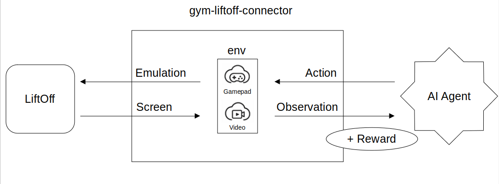
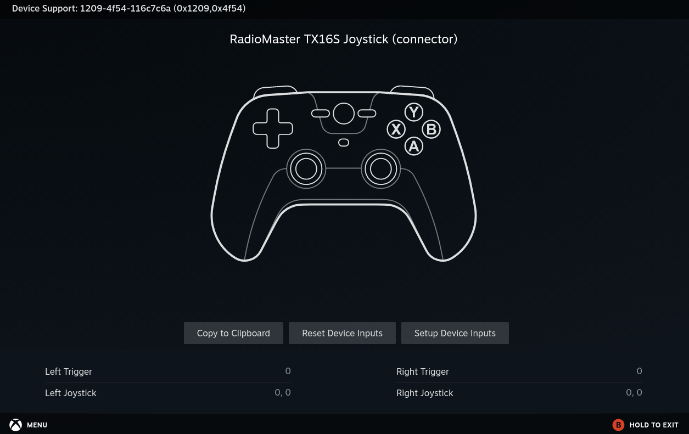
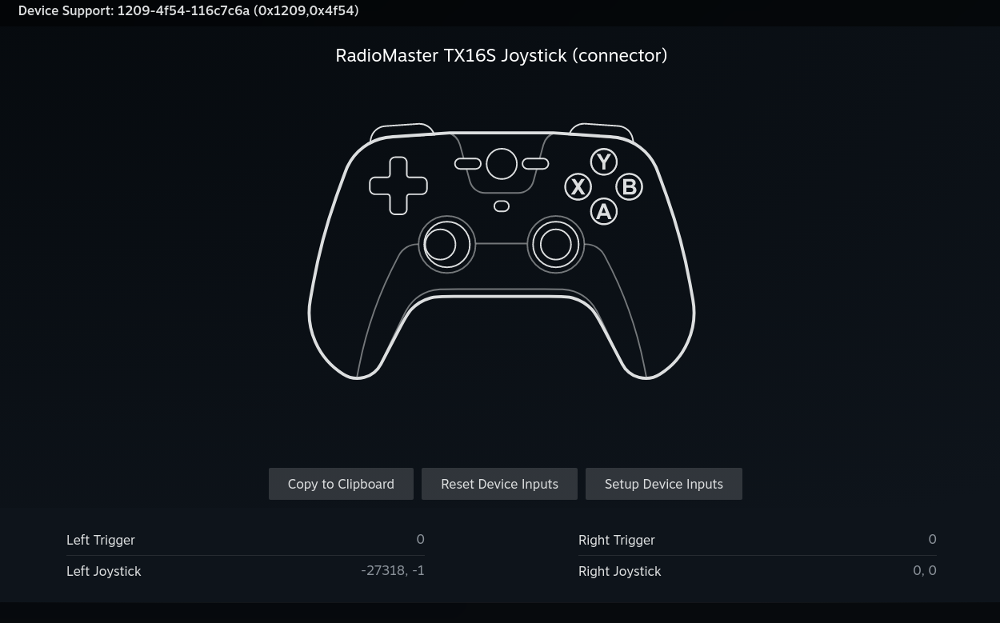
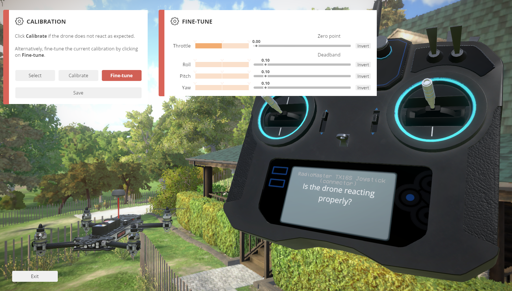

# gym_LiftOff_connector

This project serves the purpose of emulating RC transmitters to play with <i>Lift Off Drone Simulator</i> steam game.
Particularly we include all resources and set up to emulate a <b>RadioMaster TX16s radio control</b> so that AI agents can play Lift Off drone simulator.
We also describe in Section (???) the process to include other models of radio controllers.

The general schema for this project is as follows:



As shown in the schema, the project is composed of two main components:
- A python API to emulate radio control inputs (VirtualGamepad.py)
- A python API to obtain drone camera images from LiftOff (VideoSampler.py)

In-game drone camera images are directly sampled from steam using pyautogui library and converted to tensors
to be used as input for the AI agent. AI agent actions are mapped to the radio control inputs using the [uinput](https://pypi.org/project/python-uinput/#files) python library.
As a consequence the gym-liftoff-connector serves a intermediate component interfacing with both: LiftOff game and the AI external Agent.
We build an Open AI Gym environment on top of the connector to make it more homogeneous with standard reinforcement learning APIs while following the conventions of openAI gym.


## Setting Up the Python Virtual Environment (Python 3.10)

To run this project, we recommend using a Python 3.10 virtual environment to ensure compatibility with all dependencies.
Ensure Python 3.10 is available on your system:

```
python3.10 --version
```

create and activate the virtual environment

```
# Create the virtual environment
python3.10 -m venv .gym-liftoff

# Activate the virtual environment
source .gym-liftoff/bin/activate
```

Install Dependencies, first, ensure pip and setuptools are up to date:
```
sudo apt-get install python3-tk python3-dev
pip install --upgrade pip setuptools
pip install numpy gymnasium stable-baselines3 matplotlib torch opencv-python pandas pyautogui python-uinput pytesseract torchvision Pillow
pip3 install -e gym-liftoff
```

Optional: Save Dependencies to requirements.txt

```
pip freeze > requirements.txt
```

Create environment from requirements.txt file
```
pip install -r requirements.txt
```


## Documentation and examples

For further technical details please refer to XXX. If the project is useful please consider citing and contributing:

```
TODO PAPER CITE
```

The installation process and usage examples for the gym environment are described in the README.md file inside the gym-liftoff-connector folder.


## Support for other Radio Controllers

At the time we do not plan to extend the connector to other RC devices.
Nevertheless, it should not be very complicated to update the current project to support further RC devices.
The main steps to include a new RC device mainly consist of knowing the input events produced by the RC device and mapping them to the correct uinput events.
The uinput library is a linux kernel module that allows to create virtual input devices.
Then the uinput library is used to emulate the RC device inputs to the LiftOff game.
The mapping for new RC devices can be analyzed using <i>evtest</i>, or similar kernel analysis tools.

### Case study: RadioMaster TX16s

#### Determination of input events

RadioMaster TX16s radio control input events can be monitored with evtest.
Evtest is usefull to display information about the specified input device, including all the events supported by the device.
The tool is also useful to monitor the device and display all the events generated.

The following is a comprehensive list of events produced by the RadioMaster TX16s as stated by evtest:

```
Input driver version is 1.0.1
Input device ID: bus 0x3 vendor 0x1209 product 0x4f54 version 0x111
Input device name: "OpenTX RM TX16S Joystick"

Supported events:

Event type 0 (EV_SYN)
Event type 1 (EV_KEY)
Event code 304 (BTN_SOUTH)
Event code 305 (BTN_EAST)
Event code 306 (BTN_C)
Event code 307 (BTN_NORTH)
Event code 308 (BTN_WEST)
Event code 309 (BTN_Z)
Event code 310 (BTN_TL)
Event code 311 (BTN_TR)
Event code 312 (BTN_TL2)
Event code 313 (BTN_TR2)
Event code 314 (BTN_SELECT)
Event code 315 (BTN_START)
Event code 316 (BTN_MODE)
Event code 317 (BTN_THUMBL)
Event code 318 (BTN_THUMBR)
Event code 319 (?)
Event code 704 (BTN_TRIGGER_HAPPY1)
Event code 705 (BTN_TRIGGER_HAPPY2)
Event code 706 (BTN_TRIGGER_HAPPY3)
Event code 707 (BTN_TRIGGER_HAPPY4)
Event code 708 (BTN_TRIGGER_HAPPY5)
Event code 709 (BTN_TRIGGER_HAPPY6)
Event code 710 (BTN_TRIGGER_HAPPY7)
Event code 711 (BTN_TRIGGER_HAPPY8)

Event type 3 (EV_ABS)

Event code 0 (ABS_X)
Value   1024
Min        0
Max     2047
Fuzz       7
Flat     127

Event code 1 (ABS_Y)
Value   1024
Min        0
Max     2047
Fuzz       7
Flat     127

Event code 2 (ABS_Z)
Value   1197
Min        0
Max     2047
Fuzz       7
Flat     127

Event code 3 (ABS_RX)
Value   1024
Min        0
Max     2047
Fuzz       7
Flat     127

Event code 4 (ABS_RY)
Value      0
Min        0
Max     2047
Fuzz       7
Flat     127

Event code 5 (ABS_RZ)
Value      0
Min        0
Max     2047
Fuzz       7
Flat     127

Event code 6 (ABS_THROTTLE)
Value      0
Min        0
Max     2047
Fuzz       7
Flat     127

Event type 4 (EV_MSC)
Event code 4 (MSC_SCAN)
```

Out of all these possible events, we are mainly interested in the following ones:
1) Throttle     -> mapped to  ABS_Y
2) Yaw          -> mapped to  ABS_X
3) Roll         -> mapped to  ABS_RX
4) Pitch        -> mapped to  ABS_RY

Lift Off Drone simulator must be configured in order to assign this channels to the correct outputs of uinput events.
To do that, use manual calibration, checking the channels that change with each command.
1) Throttle     -> mapped to  Channel 1
2) Yaw          -> mapped to  Channel 0
3) Roll         -> mapped to  Channel 3
4) Pitch        -> mapped to  Channel 4

Debugging can be made using VirtualGamepad.py class directly, e.g.:

```python
sudo PYTHONPATH=. python3.10 -i gym-liftoff/gym_liftoff/main/VirtualGamepad.py

device.__emit__(uinput.ABS_Y, 0)      # Zero ABS_Y
device.__emit__(uinput.ABS_Y, 2047)   # Max ABS_Y
device.__emit__(uinput.ABS_X, 0)      # Zero ABS_X
device.__emit__(uinput.ABS_X, 2047)   # Max ABS_X
```

The event-channel configuration can also be directly imported using the file inside the folder called liftoff_configuration just by copying the file to our local liftoff folder as  Liftoff/Liftoff_Data/InputSettings/ba2614f0-0c69-4dd6-9dac-68b2b72e1acb/ba2614f0-0c69-4dd6-9dac-68b2b72e1acb_0001.inputsettings.
To reach the Liftoff folder, we can browse the local files of the game in Steam.

Steam controller configurations can be used to verify the correct mapping:



we obtain yaw movement by emitting ABS_X events, and throttle by emitting ABS_Y events.



Lift Off in-game controller configuration can also be used to verify the correct mapping:



We recommend living a 0.10 margin for deadband in the controller configuration.

# Contributions

We welcome contributions that further extend gym_liftoff_connector.
The easiest way to make contributions to this project is by emailing changes, opening issues on the project or proposing pull requests

